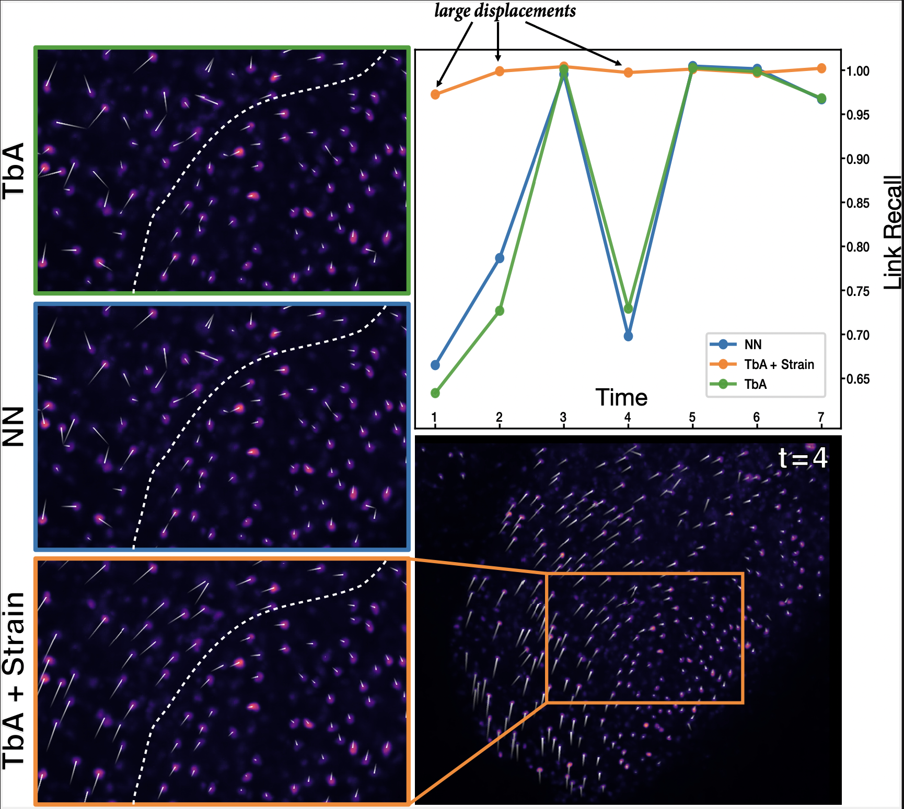

Tracking cells with "velocity gradient costs" – i.e. adding a velocity gradient regularizer
to a discrete cell tracking model.

This repo houses experiments. For the tracking model see [DetSegTra/TrackTools](https://github.com/mpicbg-csbd/detsegtra/blob/master/segtools/track_tools.py).

